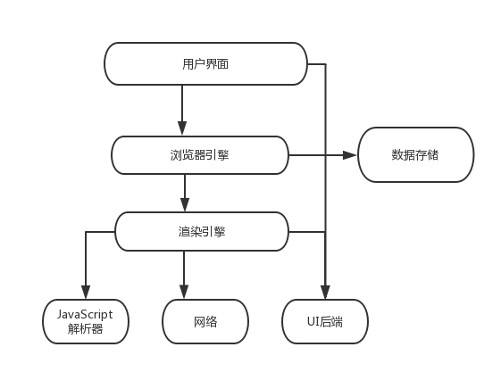
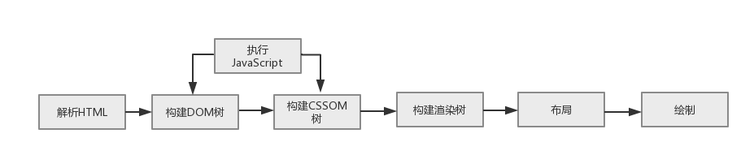
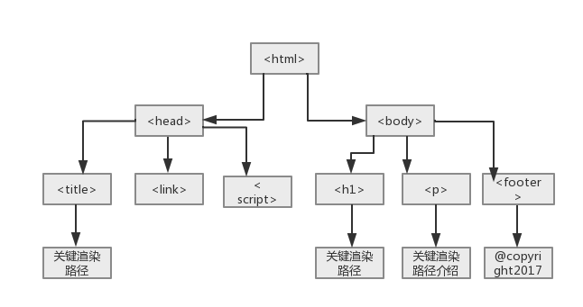
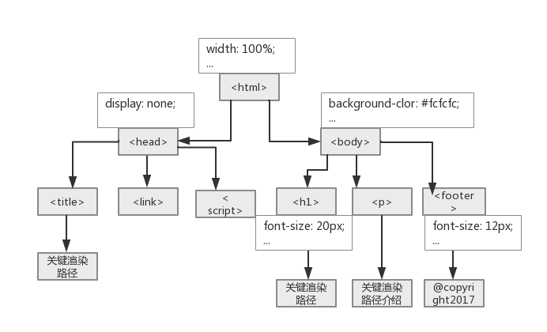
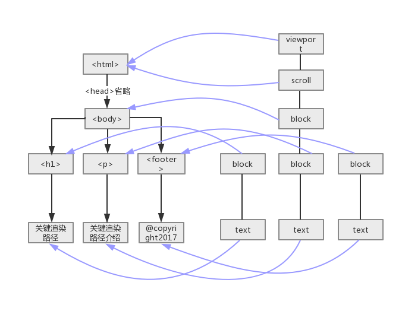

## 浅析前端页面渲染机制 :smile:

前端开发，最常见的运行环境应该是浏览器吧，为了更好的通过浏览器把优秀的产品带给用户，也为了更好的发展自己的前端职业之路，有必要了解从我们在浏览器地址栏输入网址到看到页面这期间浏览器是如何进行工作的,进而了解如何更好的优化实践，本篇主要围绕这两点展开阐述。

### 浏览器基础结构

    浏览器基础结构主要包括如下7部分：
1. 用户界面（User Interface）:用户所看到及与之交互的功能组件，如地址栏，返回，前进按钮等；
2. 浏览器引擎（Browser engine）:负责控制和管理下一级的渲染引擎；
3. 渲染引擎（Rendering engine）:负责解析用户请求的内容（如HTML或XML，渲染引擎会解析HTML或XML，以及相关CSS，然后返回解析后的内容）；
4. 网络（Networking）:负责处理网络相关的事务，如HTTP请求等；
5. UI后端（UI backend）:负责绘制提示框等浏览器组件，其底层使用的是操作系统的用户接口；
6. JavaScript解释器（JavaScript interpreter）:负责解析和执行JavaScript代码；
7. 数据存储（Data storage）:负责持久存储诸如cookie和缓存等应用数据。



### 渲染引擎 及 渲染流程
渲染引擎所做的事是将请求内容展现给我们，默认支持HTML,XML和图片类型，对于其他诸如PDF等类型的内容则需要安装相应插件，但浏览器的展示工作流程基本是一样的。
>通过网络模块加载到HTML文件后渲染引擎渲染 正常流程如下:

1. 构建DOM树(DOM tree)：从上到下解析HTML文档生成DOM节点树（DOM tree），也叫内容树（content tree）；
2. 构建CSSOM(CSS Object Model)树：加载解析样式生成CSSOM树；
3. 执行JavaScript：加载并执行JavaScript代码（包括内联代码或外联JavaScript文件）；
4. 构建渲染树(render tree)：根据DOM树和CSSOM树,生成渲染树(render tree)；
    渲染树：按顺序展示在屏幕上的一系列矩形，这些矩形带有字体，颜色和尺寸等视觉属性。
5. 布局（layout）：根据渲染树将节点树的每一个节点布局在屏幕上的正确位置；
6. 绘制（painting）：遍历渲染树绘制所有节点，为每一个节点适用对应的样式，这一过程是通过UI后端模块完成；

  图2如上：

为了更友好的用户体验，浏览器会尽可能快的展现内容，而不会等到文档所有内容到达才开始解析和构建/布局渲染树，而是每次处理一部分，并展现在屏幕上，这也是为什么我们经常可以看到页面加载的时候内容是从上到下一点一点展现的。


#### 渲染流程详解

##### 一、解析文档(parser HTML)
    
    1. 解析顺序 浏览器按从上到下的顺序扫描解析文档；

    2. 解析样式和脚本,当解析到 <script> 标签时，会解析其中的脚本,然后立即执行，这整个过程都会阻塞文档解析。

##### 二、构建DOM树
    DOM树，即文档内所有节点构成的一个树形结构。

假设浏览器获取返回的如下HTML文档：
```html
<!doctype html>
<html>
<head>
    <link rel="stylesheet" href="./theme.css"></link>
    <script src="./config.js"></script>
    <title>关键渲染路径</title>
</head>
<body>
    <h1 class="title">关键渲染路径</h1>
    <p>关键渲染路径介绍</p>
    <footer>@copyright2017</footer>
</body>
</html>
```
首先浏览器从上到下依次解析文档构建DOM树，如下：



##### 三、构建CSSOM树
    CSSOM树，与DOM树结构相似，只是另外为每一个节点关联了样式信息。

    theme.css样式内容如下：
```css
html, body {
width: 100%;
height: 100%;
background-color: #fcfcfc;
}
.title {
font-size: 20px;
}
.footer {
font-size: 12px;
color: #aaa;
}
```
构建CSSOM树如图,如下：



##### 四、执行JavaScript
上文已经阐述了文档解析时对脚本的处理，我们得知脚本加载，解析和执行会阻塞文档解析，而在特殊情况下样式的加载和解析也会阻塞脚本，所以现在推荐的实践是 <script>标签放在</body>标签前面。

##### 五、构建渲染树(render tree)
    DOM树和CSSOM树都构建完了，接着浏览器会构建渲染树：
>渲染树，代表一个文档的视觉展示，浏览器通过它将文档内容绘制在浏览器窗口，展示给用户，它由按顺序展示在屏幕上的一系列矩形对象组成，这些矩形对象都带有字体，颜色和尺寸，位置等视觉样式属性。对于这些矩对象，FireFox称之为框架（frame）,Webkit浏览器称之为渲染对象（render object, renderer），后文统称为渲染对象。
    
>这里把渲染树节点称为矩形对象，是因为，每一个渲染对象都代表着其对应DOM节点的CSS盒子,该盒子包含了尺寸，位置等几何信息，同时它指向一个样式对象包含其他视觉样式信息。 

渲染树 长什么样子:

   图5如上：

##### 六、布局（Layout）或回流（reflow，relayout）
>创建渲染树后，下一步就是布局（Layout）,或者叫回流（reflow,relayout）， 
> **这个过程就是通过渲染树中渲染对象的信息，计算出每一个** **渲染对象的位置和尺寸，将其安置在浏览器窗口的正确位置** 
>，而有些时候我们会在文档布局完成后 **对DOM进行修改**，这时候可能需要 **重新进行布局** ，也可称其为回流，本质上还是一个布局的过程，每一个渲染对象都有一个布局或者回流方法，实现其布局或回流。

###### （layout或者relayout）过程

>布局是一个从上到下，从外到内进行的递归过程，从根渲染对象，即对应着HTML文档根元素<html>，然后下一级渲染对象，如对应着<body>元素，如此层层递归，依次计算每一个渲染对象的几何信息（位置和尺寸）。


    每一个渲染对象的布局流程基本如：

    1. 计算此渲染对象的宽度（width）；
    2. 遍历此渲染对象的所有子级，依次：
    2.1 设置子级渲染对象的坐标
    2.2 判断是否需要触发子渲染对象的布局或回流方法，计算子渲染对象的高度（height）
    3. 设置此渲染对象的高度：根据子渲染对象的累积高，margin和padding的高度设置其高度；
    4. 设置此渲染对象脏位值为false。

##### 强制 relayout
>在渲染树布局完成后，再次操作文档，改变文档的内容或结构，或者元素定位时，会触发回流，即需要重新布局，如请求某DOM的”offsetHeight”样式信息等诸多情况：

- DOM操作，如增加，删除，修改或移动；
- 变更内容；
- 激活伪类；
- 访问或改变某些CSS属性（包括修改样式表或元素类名或使用JavaScript操作等方式）；
- 浏览器窗口变化（滚动或尺寸变化）

##### 七、绘制（painting）
>最后是绘制(paint)阶段或重绘（repaint）阶段，浏览器UI组件 将遍历渲染树 并 调用渲染对象的绘制（paint）方法，将内容展现在屏幕上
> **也有可能在之后对DOM进行修改，需要重新绘制渲染对象，也就是重绘，绘制和重绘的关系可以参考布局和回流的关系** 

###### 触发重绘

    我们已经知道很多操作可能会触发回流，那么什么时候可能触发重绘呢，通常，当改变元素的视觉样式。

##### 八、总结
    执行JavaScript 阻塞 进程; layout比较消耗性能; 
    重排(relayout)一定重绘,重绘不一定重排 
    修改样式，修改DOM节点区别很大 ：原因：看图2 和 图5 渲染树只跟DOM树有直接关系。
##### 九、页面渲染优化

1. HTML文档结构层次尽量少，最好不深于六层；
2. 脚本尽量后放，放在 `</body>` 前即可；
3. 少量首屏样式内联放在`<head>`标签内；
4. 样式结构层次尽量简单；
5. 在脚本中尽量减少DOM操作，尽量缓存访问DOM的样式信息，避免过度触发回流；
6. 减少通过JavaScript代码修改元素样式，尽量使用修改class名方式操作样式或动画；（非常建议）
7. 动画尽量使用在绝对定位或固定定位的元素上；
8. 隐藏在屏幕外，或在页面滚动时，尽量停止动画；
9. 尽量缓存DOM查找，查找器尽量简洁；
10. 涉及多域名的网站，可以开启域名预解析


#### 参考链接
[页面渲染机制](https://blog.csdn.net/buzhibujuell/article/details/68952370)