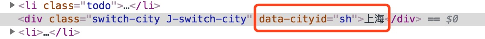
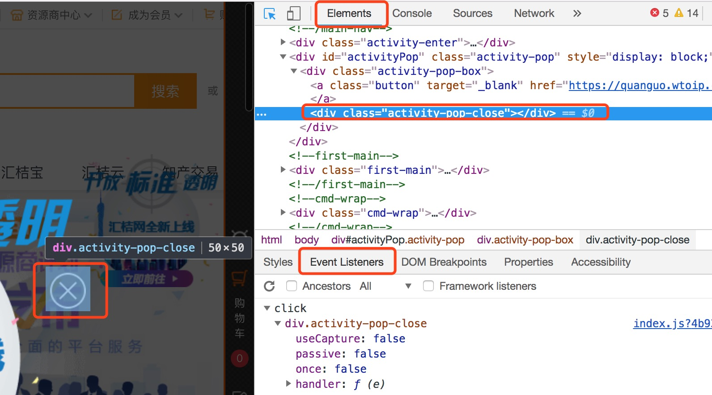
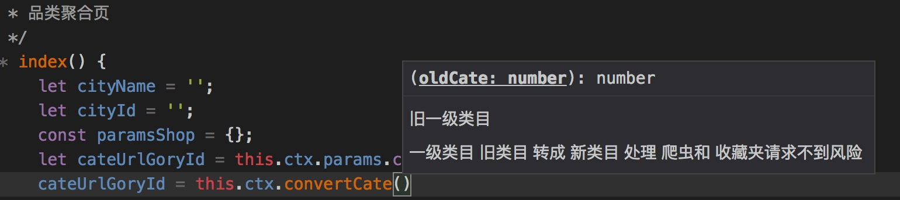

## 编码规范（共同参与一起完善）:pray:

> 开玩笑时候，吹牛：我反手就是一个不可维护的代码。 避免我们加班写bug,加班改bug :sob:
#### 一：整体规范
    以下列举了一些可应用在 HTML, JavaScript 和 CSS/SCSS 上的通用规则。
1. 文件命名默认 以 “-” 符号做单词拼接（不强制);
    如果框架有要求，按照框架要求; 如果是老项目，按照老项目统一风格
>原因:统一;驼峰命名 有的IDE 强制大小写转换,或者不区分大小写,造成文件重名
2. 命名语义化 （文件名,css,html属性,js变量,方法,对象）;

    [语义化在线工具](http://unbug.github.io/codelf/) 

**除了JS 驼峰命名，其他命名都以“-”符号做单词拼接**

#### HTML篇
1. 使用 HTML5块级元素做整体布局,语义化新标签 替换不必要的div和老标签
>例如:
```html
 增加结构标签
（1）section：独立内容区块，可以用h1~h6组成大纲，表示文档结构，也可以有章节、页眉、页脚或页眉的其他部分；
（2）article：特殊独立区块，表示这篇页眉中的核心内容；
（3）aside：标签内容之外与标签内容相关的辅助信息；
（4）header：某个区块的头部信息/标题；
（5）hgroup：头部信息/标题的补充内容；
（6）footer：底部信息；
（7）nav：导航条部分信息
（8）figure：独立的单元，例如某个有图片与内容的新闻块。
```
详细见：[新增标签和属性](https://blog.csdn.net/garvisjack/article/details/54754928) |
       [离我们远去的标签](https://www.oschina.net/news/78180/dumped-html-label) |
       [w3school](http://www.w3school.com.cn/)
>原因:语义化;稳定性更好

2. 层级避免太深,模块化处理
>原因:美观;便于维护;浏览器生成DOM树友好

3. 添加样式绑定class
>原因:便于维护;美观,语义化

4. 添加JS绑定class
>原因:便于维护;美观,语义化

5. 属性名避免 驼峰命名
>原因:(有坑)HTML部分属性驼峰,浏览器自动变成小写,导致JS获取不到
```html
    <div class="switch-city J-switch-city" data-cityId="sh">上海</div>
```
编译结果如下:


6. img标签添加 alt 属性
>原因:图片替代内容;SEO有益;盲人阅读

7. 尽量不使用大量行内样式
>原因:美观;分工名确;便于维护

8. HTML中 属性全部使用双引号(""),而不是单引号
>原因:稳定,不易出错;JS和HTML混排时,更稳定

9. 转义字符 尽量少
>原因:SEO友好

#### 二：CSS篇
1. 一般情况下ID不应该被应用于样式
>原因:ID的样式不能被复用并且每个页面中你只能使用一次ID;ID默认有JS操作

2. 添加语义化的class,避免结构化的添加样式,选择器中避免标签名
>原因:语义化便于维护,复用;避免结构变动,样式崩溃

**不推荐** :sweat_smile: 
```html
<div class="sel-category">
    <p>类目选择</p>
    <ul>
        <li>
            <span>英文命名</span>
            <b>500元</b>
        </li>
    </ul>
</div>
```
```css
.sel-category {
    >ul{
        overflow:hidden;
        >li {
            float:left;
            b {
                font-size:16px;
                color:red;
            }
        }
    }
}
```
**推荐** :smile: 
```html
<div class="sel-category">
    <p>类目选择</p>
    <ul class="category-list J-category-list">
        <li class="category-item J-category-item">
            <span>英文命名</span>
            <b class="cate-item-price">500元</b>
        </li>
    </ul>
</div>
```
```css
.category-list {
    overflow:hidden;
    .category-item{
        float:left;
        .cate-item-price {
            font-size:16px;
            color:red;
        }
    }
}
```
3. 尽可能的精确 , 使用直接子选择器（注：直接子选择器和后代选择器的区别）
>原因:减少性能消耗

4. 缩写属性
>原因:CSS提供了各种缩写属性（如 font 字体）应该尽可能使用，即使在只设置一个值的情况下,提高代码效率和可读性

5. 省略“0”值后面的单位。
>原因:减少性能消耗

6. 移动端适配 
```
>方法一: 全部使用rem 全局样式编写媒体查询语句,修改根节点html的font-size 控制页面大小样式
>方法二: less sass stylus 
//定义一个变量和一个mixin,less写法
.px2rem(@name,@px){
    @{name}: @px / @baseFontSize * 1rem;
}
>方法三: Sublime Text3插件
>方法四: npm px2rem 安装包
```

#### 三：JS篇
0. 'use strict'
>原因:减少不必要的错误

1. 业务逻辑页面 js面向对象 简化封装(增加参数区分)。

>例如:
```js
'use strict'
// 发布逻辑
const FB = {
    // 发布
    _selCategory: $('.J-sel-category'),
    _boxCategory: $('.J-box-category'),
    _secondItem : $('.J-second-item'),
    _thirdItem  : $('.J-third-item'),
    _successPox : $('.J-pub-success-pox'),
    _phone      : $('.J-phone-input'),
    isPending:false,
    isSel:false,
    isLogin:false,       //是否登录
    sumbitData:{
        title:'',        //需求标题
        categoryId:'',   //需求id
        userId:'',       //需求人
        phone:'',        //手机号
        wayType:1        
    },
    // 初始化
    init: function () {
        this.event();
        this.isLoginFn();
    },
    // 判断是否登录
    isLoginFn: function () {
        var me = this;
        ......
    },
    // 页面事件绑定
    event: function () {
        var me = this;
        // 类目显隐
        me._selCategory.on('click',function () {
            me._boxCategory.slideToggle(300);
            return false;
        });
        // 选择类目 后添加的ele元素 采用事件代理
        me._thirdItem.on('click','li',function () {
            ......
        });
        // 是否重新登录 多重事件绑定
        me._phone.on('change blur',function () {
            ......
        })
    },
    // 异步获取类目
    ajaxGetCategory:function () {
        var me = this;
        if(me.isPending) {
            return
        }
        me.isPending = true;
        $.ajax ({
            data:{
                ct_bid:me.sumbitData.categoryId,
            },
            url:'/ajax/zt/getCategory',
            type:'post',
            dataType:'JSON',
        }).done (function (res) {
            if(res.success && res.data.ct_bid) {
                var baseCategoryId = res.data.ct_bid;
                me.ajaxHttps(baseCategoryId);
            }else {
                _toast({msg:'基础类目获取失败'});
            }
        }).fail (function (err) {
            _toast({msg:'网络故障，无法连通'});
        }).always(function () {
            me.isPending = false ;
        });
    },
    // 商机调用
    ajaxHttps:function (baseCategoryId) {
        ......
    },
    // 提交完成
    ajaxFinish:function () {
        ......
    }
}
// 初始化调用
FB1.init();
// 或者module.exports导出
```

>原因:结构化,模块化,方便复用;全局污染底;方便排查,便于维护

2. 事件绑定:添加 "J-xxx"开头的时间绑定class,对象创建时统一获取,重复使用
>原因:减少JS捕获DOM次数,提高性能;方便排查,便于维护

3. 初始化ELE,减少事件代理绑定; 添加的ELE 移动端IOS 使用“on”替换“delegate”,事件代理就近原则
>原因:事件代理委派,不直接,不方便排查问题;body代理事件过多,冲突

直接绑定的事件,排查如下图:



4. 单个业务内的全局变量 存在全局对象的属性上,避免 添加变量 或 方法到 window
>原因:减少全局污染,变量方法冲突
5. 巧用 class 去掉 css; 巧用class去掉事件绑定
>例如:
```js
// 不推荐css推荐行内样式
$(this).css({
    color:'red',
    background:'#fff'
})
// 推荐class添加激活样式
$(this).addClass('on');


// 初始化事件绑定
$('.J-click-allow').click(function(){
    ......
})
// 取消事件绑定
$(this).removeClass('J-click-allow')
```
>原因:美观,效率,便于维护

6. 变量缓存虚拟dom,一次性添加进入DOM树

> **不推荐** :sweat_smile: 
```js
for(var i=addR.length-1;i>=0;i--){
    if(addR[i] != undefined){
        $('<li><h3>'+ addR[i] +'</h3></li>').appendTo($('.search_history ul'));//循环创建li
    }
}
```
> **推荐** :smile: 
```js
// 循环创建li
var htmlEle = '';
addR.reverse().map(function(v,i){
    if(!v) {
        htmlEle+= '<li><h3>'+ v +'</h3></li>'
    }
})
// $historyUl jquery对象挂在 全局对象的属性上
$(htmlEle).appendTo(me.$historyUl);
```

>原因:减少DOM操作,减少重排

7. 异步增加关闭操作
>例如:
```js
    // 异步获取类目
ajaxGetCategory:function () {
    var me = this;
    if(me.isPending) {
        return
    }
    me.isPending = true;
    $.ajax ({
        data:{},
        url:'/ajax/zt/getCategory',
        type:'get',
        dataType:'JSON',
        complete:function(){
            ......
            me.isPending = false;
        }
    })
}
```
>原因:防止多次并发获取,多次操作dom树

8. 先判断数据类型,再调用对应API
```js
// 方法一：typeof
typeof '' === 'string';
typeof 0  === 'number';
typeof ture === 'boolean';
typeof function (){} === 'function'
// 方法二：常用 和 封装
Array.isArray([]);

function isType(obj,type){
    return Object.prototype.toString.call(obj) ==="[object "+type+"]";
}
console.log(isType([],"Array"));
console.log(isType(1,"Number"));
console.log(isType("","String"));
console.log(isType(new Date(),"Date"));
console.log(isType(function(){},"Function"));
console.log(isType(new RegExp(),"RegExp"));
console.log(isType({},"Object"));
console.log(isType(true,"Boolean"));
console.log(isType(null,"Null"));
console.log(isType(undefined,"Undefined"));

// 方法三：$.type()
$.type() === "undefined"

$.type( null ) === "null"

$.type( undefined ) === "undefined"

$.type( {} ) === 'object'

$.type( true ) === "boolean"

$.type( 3 ) === "number"

$.type( "test" ) === "string"

$.type( function(){} ) === "function"

$.type( [] ) === "array"

$.type( new Date() ) === "date"

$.type( new Error() ) === "error" // jQuery 1.9 新增支持

$.type( /test/ ) === "regexp"

// 其他一切都将返回它的类型“object”。
```
>原因:保障代码健壮性,防止报错,程序卡死

9. 非空判断
```js
// Boolean类型为 false 的有：null，0，''，undefined，NaN，false　
console.log(Boolean(false) === false);
console.log(Boolean(null)  === false);
console.log(Boolean('')    === false);
console.log(Boolean(0)     === false);
console.log(Boolean(NaN)   === false);
console.log(Boolean(undefined) === false);

// 注意点
console.log(Boolean([])  === true);
console.log(Boolean({})  === true);
console.log(Boolean(' ') === true);
```
>原因:保障代码健壮性,防止报错,程序卡死

9. 巧用 return 减少 if else 嵌套层级
>例如:
```js
    if(Array.isArray(res.data)){
        return
    }
    res.data.map(function(v,i){
        ......
    })
```
>原因:美观容易维护

10. 定义方法(公共,私有) 需要添加 备注(方法用途;入参:类型、说明)

>例如:
```js
/**
    * 一级类目 旧类目 转成 新类目 
    * 处理 爬虫和 收藏夹请求不到风险
    * @param {Number} oldCate 旧一级类目
    */
convertCate (oldCate) {
    let newCate = Number(oldCate);

    if (isNaN(newCate)) {
        return oldCate
    }
    switch (newCate) {
        case 38:
        case 20:
            newCate = 40;
            break;
        case 10:
            newCate = 41;
            break;
        default:
            newCate = oldCate;
    }
    return newCate;
}
```
>原因:方便调用者使用和维护;IDE智能提示



11. 代码小而美,能提出公用的,尽可能封装简短

> **不推荐** :sweat_smile: 
```js
const pageData = this.ctx.service.gatewayApiService.getPageData(cateUrlGoryId + cityNameUrl + '_cityCategory_Wap', cateUrlGoryId + cityNameUrl + '_cityCategory_Wap', 'v2.8'), // 获取页面基本配置
```
> **推荐** :smile: 
```js
const parmUrl = `${cateUrlGoryId}${cityNameUrl}_cityCategory_Wap`;
// 获取页面基本配置
const pageData = this.ctx.service.gatewayApiService.getPageData(parmUrl, parmUrl,'v2.8');
```
>原因:美观,培养模块思想

### 参考链接

[前端编码规范](https://www.w3cschool.cn/bdl2e3/)
