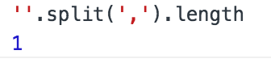
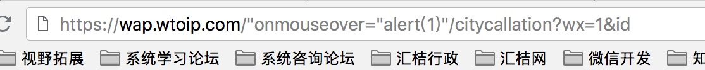
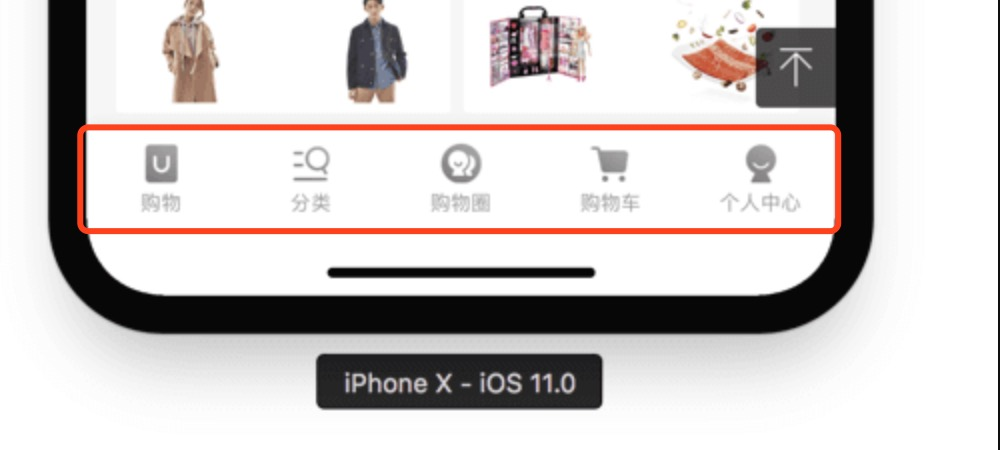

## 实际中的bug 案例（感谢各位优化人员，大家共同借鉴，共同进步）:pray:

### 一、案例上传要求：
1. 实际中bug,有一定普遍性,或者隐藏性;而不是因为 大意的 语法错误。
2. 小而美,细节问题最好, 而不是大的结构性问题。

### 二、案例上传格式：

1. 分享编号: 分享xx:new Date().toLocaleString()   :+1: 优化人
2. 图片 或 描述 (文字|代码|截图) 图片命名:new Date().getTime()
3. 优化方法

### 三、实际案例

#### 分享1: 2018/7/18 上午10:20:01  :+1: lxq

问题细节入下：
<br/>


```html
    描述：city项目一个小bug ，后端数据返回为"",前端过滤器函数切割后数组length 为1 ，然后循环
    优化：过滤器函数添加 非空判断，数据使用添加非空判断
```

#### 分享2: 2018/7/18 下午2:57:48  :+1: lxq
问题细节如下：(浏览器放弃xss过滤后,URl里面内容不可信)
<br/>


```html
    描述：city项目，m项目，在node层获取 url 参数,例如:this.ctx.params.xx|this.ctx.query.xx
         没有对 参数做转义加密。
         期待值是 数字或者字母,但是xss攻击者给的参数是 一段js代码或其他代码。 
         没有做 转义加密，直接请求接口，或者在模板上回显前端，导致问题出现。
    优化：js API escape()处理;该方法不会对 ASCII 字母和数字进行编码，也不会对下面这些 ASCII 标点符号进行编码： * @ - _ + . / 。其他所有的字符都会被转义序列替换。
```

#### 分享3: 2018/8/9 上午9:51:05  :+1: zym
问题细节如下：(iphoneX钉钉浏览器:"position:fixed;bottom:0",出现悬空，安全距离间隔)
<br/>


```html
    描述：iPhoneX 取消了物理按键，改成底部小黑条，这一改动导致网页出现了比较尴尬的屏幕适配问题。
    优化：iphonex 安全区域适配问题：
    1.<meta name="viewport" content="width=device-width,height=device-height,initial-scale=1.0, minimum-scale=1.0, maximum-scale=1.0, user-scalable=no,viewport-fit=cover">
    2.需要在底部安全位置的元素添加
    padding-bottom: constant(safe-area-inset-bottom);
    padding-bottom: env(safe-area-inset-bottom);
    元素在高度会被拉大 设置背景颜色：填充安全微信使它不要透底部元素。
```
参考链接:[网页适配 iPhoneX，就是这么简单](https://aotu.io/notes/2017/11/27/iphonex/)