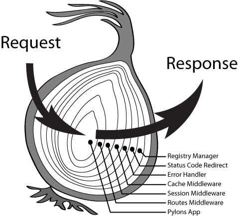

### 开发模式浅究 :smile:
#### 一 中间件模式 

##### Express 中间件模式

1. express代码 
```js
var express = require('express');
var app = express();
```

2. 流程图

3. 复杂一点的流程图


##### Koa 异步中间件模型
 >  Koa 的异步中间件模式-洋葱模型，相比 Express，其中间件函数返回 Promise，支持 async/await，并且可以轻松实现前置和后置的处理。毫无疑问这个模式更加先进，一些在 express 里面不好实现的拦截处理逻辑，比如异常处理和统计时间，在 Koa 里用一个中间件就能搞定。然而遗憾的是 Koa 本身只提供了 Http 模块和洋葱模型的最小封装。

#### 二 MVC 模式
1. 前端MVC
>   以AngularJS MVC 为例, Controller函数注册到页面 View 上, 用户操作 页面交互 触发 Controller 中的函数, Controller 处理逻辑后, 修改Module数据 , Moudle更新 View 视图 (2015年学习的Angular1.0)

2. 我们今天要讲的 MVC 模式是指在服务器上（后端） MVC 模式
    简单流程如下：

>   用户 通过 url,http 协议命中路由, Router 作为一个触发器（提供了一种映射关系）触发控制器,处理数据Module,定位模板View. 在写测试的时候，我们也可以跳开 Router 单独调用 Controller.

#### 三 目前项目模式
1. 看到上面的两种模式，是不是已经开始想，那有没有一个框架同时是 Koa + Router + MVC 
2. 企业级 Web 框架 阿里的[egg](https://eggjs.org/zh-cn/),360的[ThinkJS 3.0](https://thinkjs.org/)
3. 我司 EGG + webpack 开发模式如下:

- 整体目录结构


- 扩展功能目录


>   后端渲染 模板,响应前端 url http 请求。用户的同步异步请求,命中 **路由** (详见[egg路由](https://eggjs.org/zh-cn/basics/router.html)) 触发路由对应的 **控制器** 函数

```js
// 聚合页
app.get('/:focusId/', app.controller.focus.index.index.index);

// 发送手机验证码
app.post('/api/sendSmsCode/', app.controller.focus.index.index.sendSmsCode);
```
>   **控制器** 处理业务逻辑,调用接口,整合 **Module** 数据,指定模板 **View** || 返回数据  || 跳转重定向

- 指定模板
```js
pageData.title = `${cityName}`;
yield this.ctx.render('focus/index/index.html', pageData);      
```
- 返回数据

```js
//1.返回JSON 数据
const pageData = yield this.ctx.service.cityService.sendCode(mobile);
this.ctx.body = pageData;

//2.返回HTML 
const pageData = yield this.ctx.service.cityService.getList(token, pageSize);
const html = yield this.ctx.renderVi('list/content-box/tmpl/box.html', pageData);
this.ctx.body = html
```
- 跳转重定向

```js
this.ctx.redirect(redirectUrl);
```


##### 链接参考
1. [75团：Web框架的架构模式探讨](https://75team.com/post/web-architecture-patterns-javascript)
2. [谈谈UI架构设计的演化](http://www.cnblogs.com/winter-cn/p/4285171.html)