# 微信小程序开发实践总结

#### 分享: 2018/10/29 下午1:50:29  :smile:​ lxq

### 一、小程序基本认识

##### 1.与HTML5区别
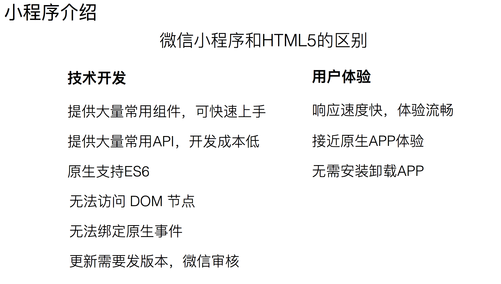
##### 2.HTML CSS
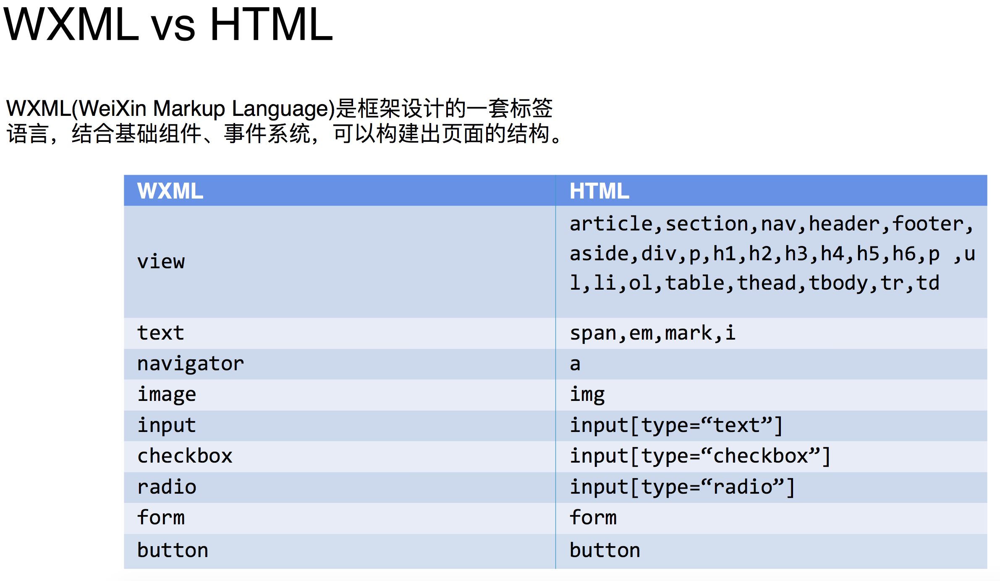
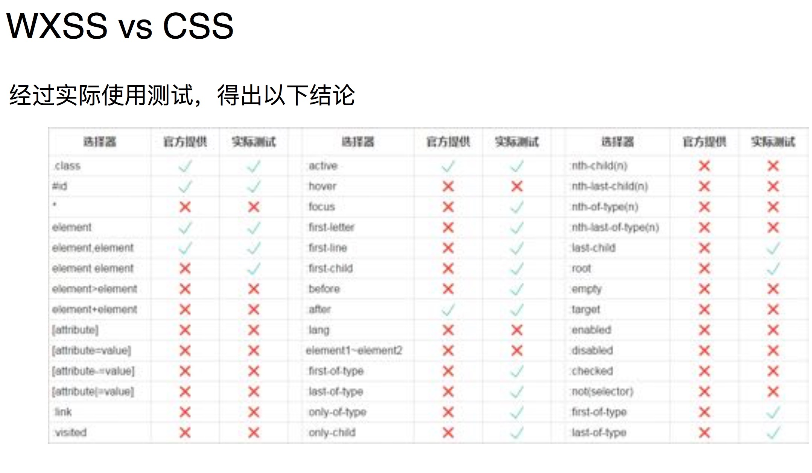
##### 3.常用API
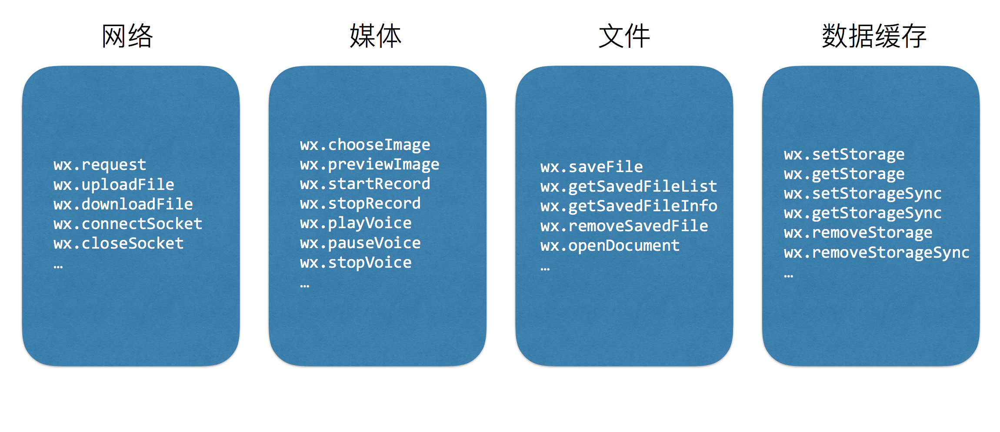
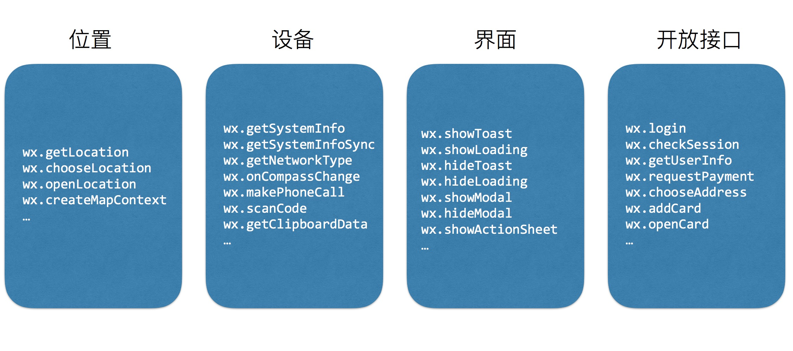
##### 4.真机代理配置
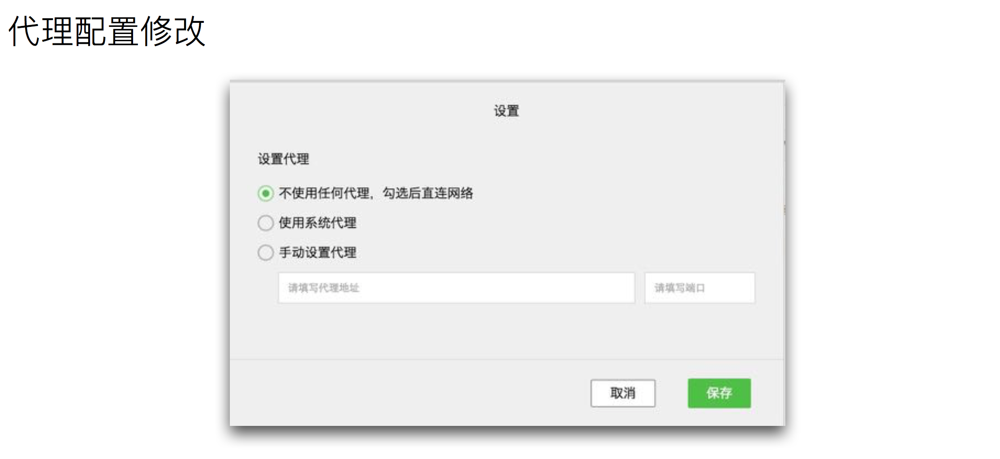
##### 5.字符串模板
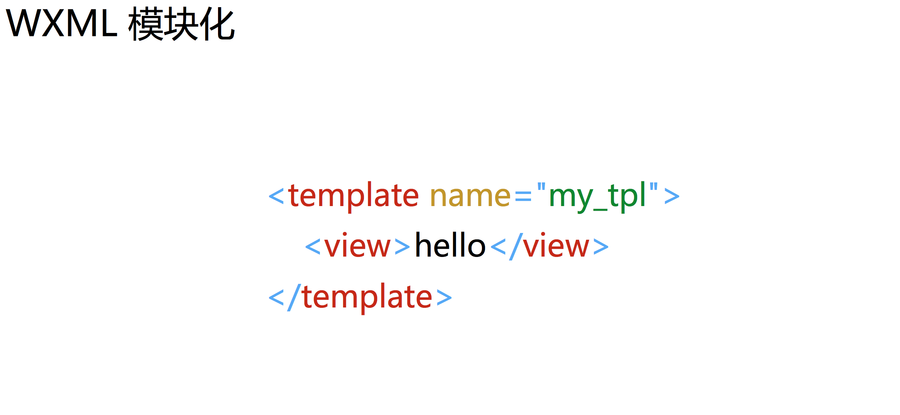
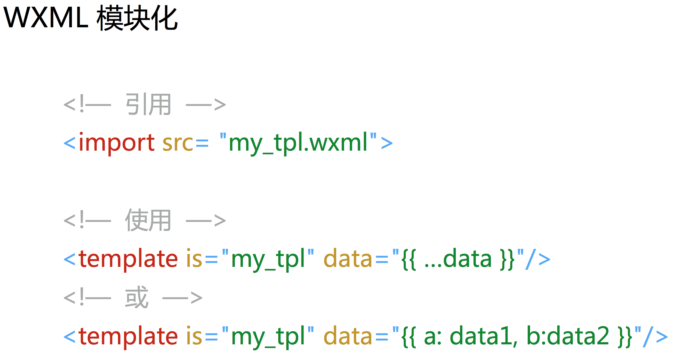
##### 6.小程序实例，和全局变量
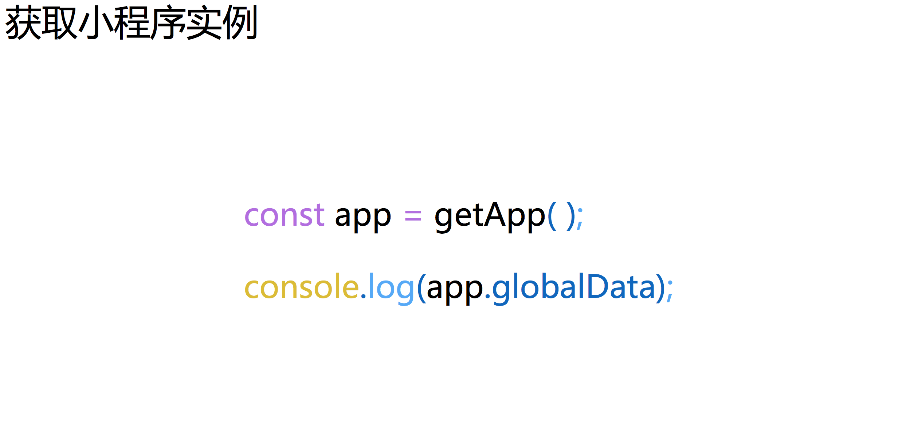
##### 7.页面生命周期
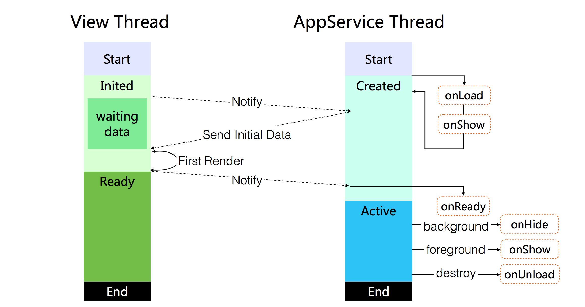
##### 8.Vue对比：数据操作
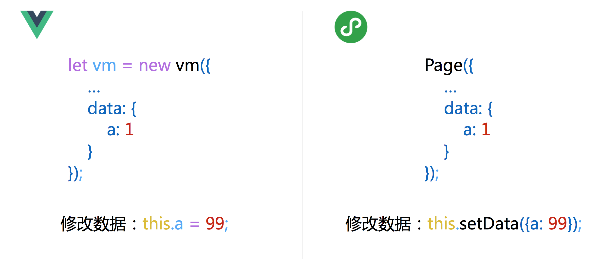
##### 8.Vue对比：计算属性
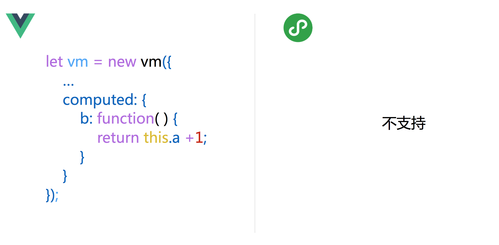
##### 8.Vue对比：数据绑定
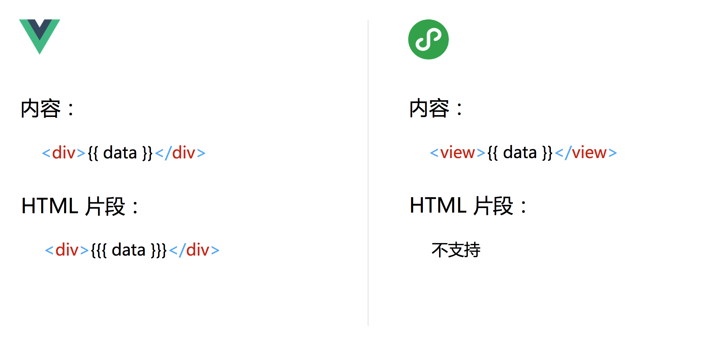
##### 8.Vue对比：属性绑定
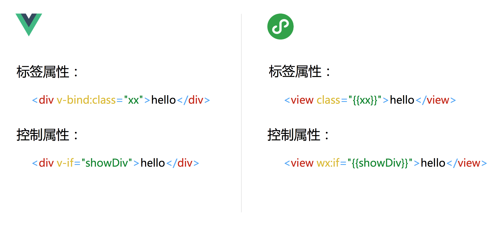
##### 8.Vue对比：{{}}支持的 js 
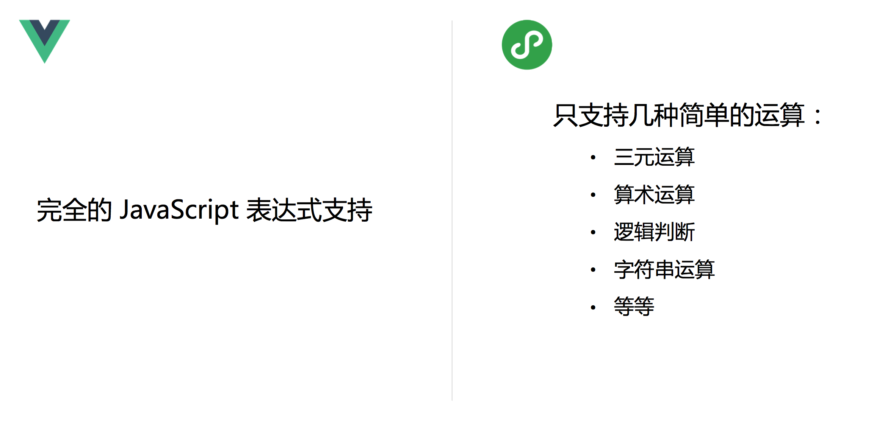
##### 8.Vue对比：class增强
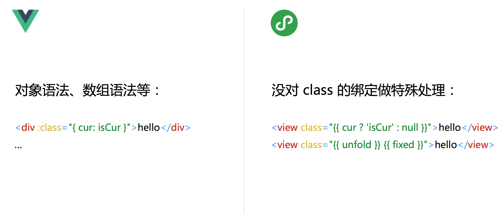
##### 8.Vue对比：条件
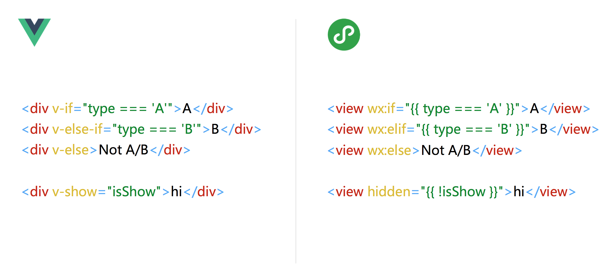
##### 8.Vue对比：列表
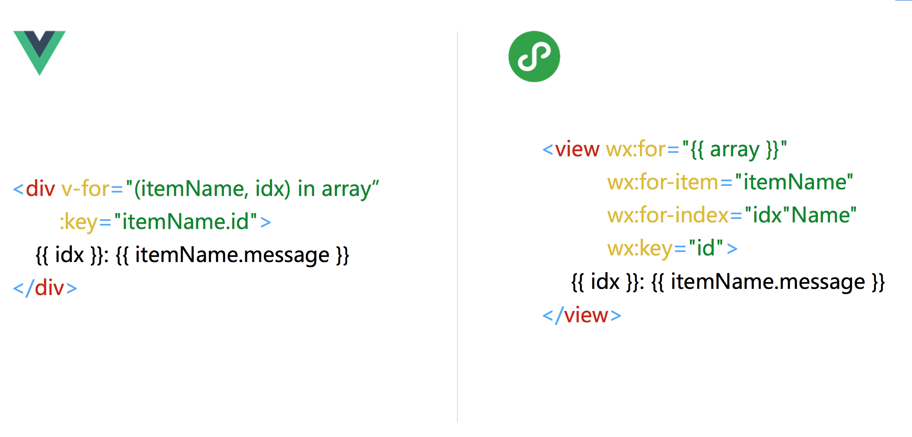
##### 8.Vue对比：事件 表单回显数据
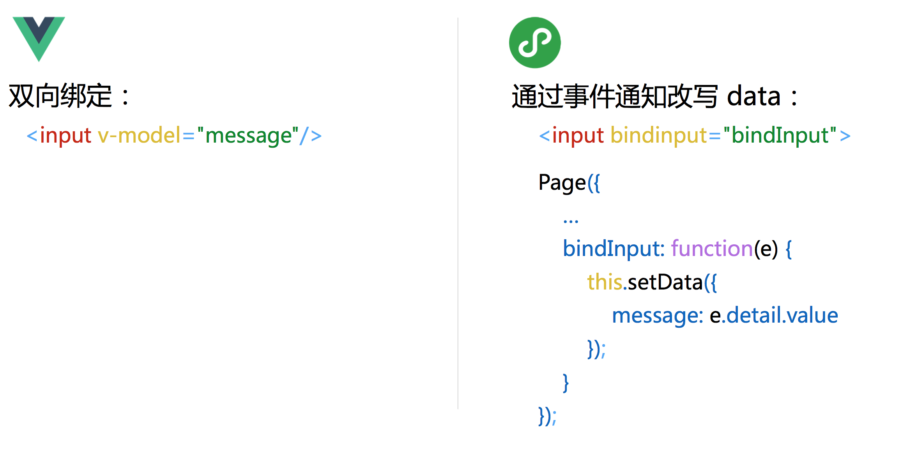
##### 9.建议
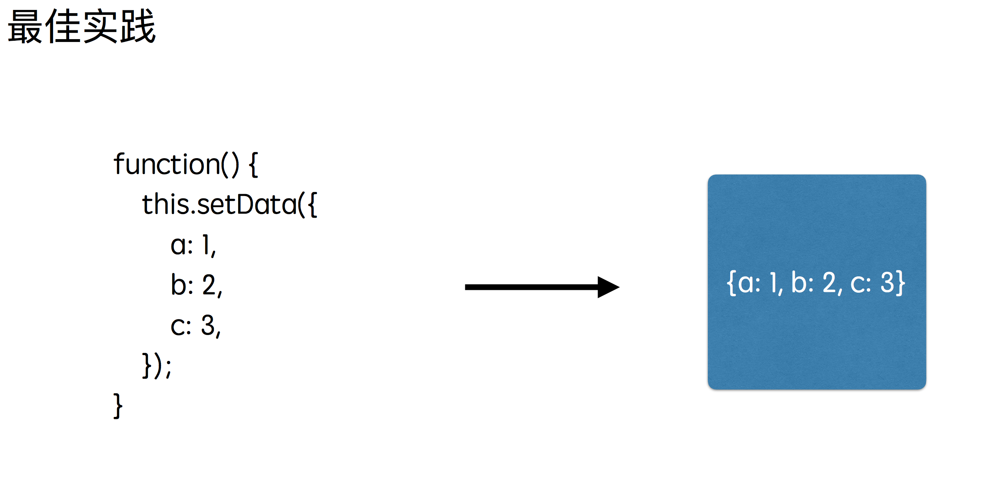

### 二、小程序开发易出错点

##### :sweat_smile:一：
```
innerAudioContext.onTimeUpdate 监控音频播放时间更新，监控函数不启动；
方法：定时器调用一下innerAudioContext.duration,获取一下总时间
```
##### :sweat_smile:二：
```
组件调用 <text1. 标签包不住 里面的 view; 
方法：改用 <view>
```
##### :sweat_smile:三：
```
app.wxss 里面 @import './style/iconfont’后，components里面的组件 用不到 样式；
方法：组件内部样式 @import 一下
```
##### :sweat_smile:四：
```
组件 在 页面 hide 和 unload 时候得退出 ，应该退出组件内部没有结束的交互（比如组件中播放音频）； 
方法：组件生命周期 hide（仅在tab切换有效） , 父级页面生命周期 unload 处理！
```
##### :sweat_smile:五：
```
安卓手机 video 标签 在蒙版上，滑动变样子了；
http://www.cnblogs.com/fiy-noob/p/9456774.html
方法： <view class="viewB" catchtouchmove="handleMove"></view>
```
##### :sweat_smile:六：
```
微信小程序的过程中可能有的小伙伴发现transition这个属性它不好使
方法：
我们这个时候会考虑去使用微信官方提供的wx.createAnimation API来创建动画。
1:创建一个动画实例 animation。调用实例的方法来描述动画。最后通过动画实例的 export 方法导出动画数据传递给组件的 animation 属性。
2:表示一组动画完成，可以在一组动画中调用任意多个动画方法，一组动画中的所有动画会同时开始，一组动画完成后才会进行下一组动画。
```
##### :sweat_smile:七：
```
页面反复跳转超过10级，不跳了。
方法：
wx.redirectTo(Object object)
关闭当前页面，跳转到应用内的某个页面，但是不允许跳转到 tabbar 页面。
```
##### :sweat_smile:八：
```
录像使用
wx.chooseVideo(Object object)
拍摄视频或从手机相册中选视频。
而不是使用   
CameraContext
```
##### :sweat_smile:九：
```
:sweat_smile:九：
父组件向子组件传 变量，
子组件向父组件传 事件，
父组件需要在 必要时（退出） 调用子组件的方法处理 子组件自身效果 
this.selectComponent(“#id”)
```
##### :sweat_smile:十：
```
onShareAppMessage(Object) 转发分享
监听用户点击页面内转发按钮或右上角菜单“转发”按钮的行为，并自定义转发内容。
方法：
这个事件监听只能放在当前Page 里面，不能用在 组件内，无效！
如果要在转发 过程中 添加其他操作，目前是 white 计算时间阻断程序
```
##### :sweat_smile:十一：
```
ctx.drawImage 绘制图片时候，真机显示不出来，
方法：
先请求，再绘制
wx.getImageInfo({
    src: 'http://yuntu-img-new.oss-cn-shanghai-finance-1-pub.aliyuncs.com/applyCard/share/card_sahre_bg.png',
    success(res){
    ctx.drawImage(res.path,0,0,100,100)
    ctx.draw()
    }
})
```
##### :sweat_smile:十二：
```
wxs 只能 es5  区别于 js  没有数据隐式转换
能在组件的 .wxml 里面使用，
不能在 template 的 .wxml 里面使用
方法：template 里面数据js处理后传入
```
##### :sweat_smile:十三
```
自定义的组件的 入参值 ，禁止使用 id, class, data 等 标签属性  作为字段
```
##### :sweat_smile:十四
```
真机：
原本静态 <video1. 能被 <cover-view1. 覆盖
BUT:
如果 原生组件  比如 <video1. 组件 是异步ajax 判断 后显示绘制到页面上的，
则提前绘制的<cover-view1. 组件真机无法覆盖 <video>
在ajax 后显示绘制<cover-view>组件，但是 上拉加载的新的 <video1. 又会覆盖到<cover-view>
方法：
每次 ajax 后，重绘 cover-view 组件
```
##### :sweat_smile:十五
```
wx.uploadFile name 参数是重点（后端接口定义的 入参 key）
wx.uploadFile 只是 把 二级制文件扔到我们的服务器接口，我们服务器通过key 找到这个文件流，还得靠我们自己的接口将文件流上传到自己的服务器
```
##### :sweat_smile:十六
```
太阳码:page字段  不添加'/'
转发:path字段    添加 '/'
```
##### :sweat_smile:十七
```
1:page样式文件中的view元素的样式 能直接影响到 组件中的view样式
2:如果page 的class 类样式如果不做 扩展或者全局 设置，组件样式不会起作用
```
##### :sweat_smile:十八
```
修改列表个别数据
this.setData({
    ['testList[' + i + '].name']: testList[i].name,
    ['testList[' + i + '].time']: testList[i].time
})
```

### 三、本次项目开发 可借鉴的功能点 :gift:​

#####  :cyclone:​ 1.分享绘图、转发、获取太阳码
1. 参考 src/components/wx-share/wx-share.js

#####  :cyclone:​ 2.上传图片语音阿里云、上传视频腾讯云、预览图片wx.previewImage
1. 参考 src/utils/wx-api.js
2. 参考 src/pages/answer/answer-video-pre/answer-video-pre.js

#####  :cyclone:​ 3.银行识别-腾讯AI
1. 参考 https://ai.qq.com/doc/ocrcreditcardocr.shtml
2. 参考 https://ai.qq.com/doc/auth.shtml
3. 参考 src/pages/user-center/my-wallet/put-forward/put-forward.js
```
逻辑:
    注册QQAI.APPID, 
    base64图片,拼装参数,接口签名计算,
    请求接口->处理结果
```
#####  :cyclone:​ 4.全部请求添加签名处理
1. 参考 src/utils/wx-api.js
#####  :cyclone:​ 5.百度地图定位 微信地图小程序
1. 参考 http://lbsyun.baidu.com/index.php?title=wxjsapi
2. 参考 src/pages/consult/address/address.js
#####  :cyclone:​ 6.小程序富文本解析
1. 参考 https://github.com/icindy/wxParse
2. 参考 src/pages/answer/essay-detail/essay-detail
#####  :cyclone:​ 7.微信登录 支付 
1. 参考 https://developers.weixin.qq.com/miniprogram/dev/framework/open-ability/login.html
2. 参考 https://pay.weixin.qq.com/wiki/doc/api/wxa/wxa_api.php?chapter=7_3&index=1
3. 参考 src/utils/common.js
```
逻辑:
    wx.login() =>code 
    服务端 =>openId
    前端先请求接口->中间->（接口服务器得跟 腾讯服务器建立一次关系），并返回 签名，数据包，等信息
    wx.requestPayment =>支付调起, 自定义返回promise
```
#####  :cyclone: ​8.打开文件 和 短号拨打
1. 参考 src/utils/common.js
#####  :cyclone: ​9.直播间
2. 参考 https://cloud.tencent.com/document/product/454/12517
3. 参考 https://cloud.tencent.com/document/product/454/12518
4. 参考 https://github.com/TencentVideoCloudMLVBDev/MiniProgram

#####  :cyclone:10.小程序图片转base64
1. 参考 src/pages/user-center/my-wallet/put-forward/put-forward.js
```
获取全局唯一的文件管理器
wx.getFileSystemManager()
读取本地文件内容
FileSystemManager.readFile(Object object)
FileSystemManager.readFileSync(string filePath, string encoding)

实际调用
wx.getFileSystemManager().readFileSync(url, 'base64');
```
#####  :cyclone: ​11.全局
1. 打包构建,目录分配
2. request,上传方法 转 promise
3. 数据请求添加签名
4. 模板过滤器函数
5. image error 处理（简化添加纯色背景）
6. textarea emoji过滤
7. 未登录统一处理
> 参考 内部项目分享

